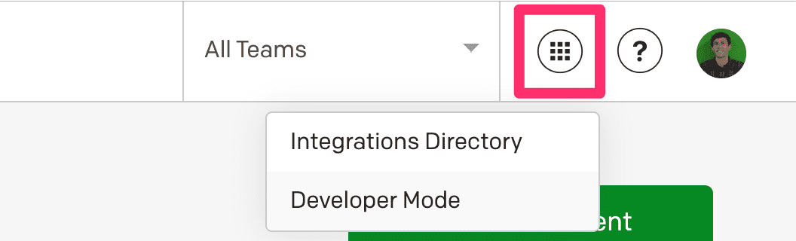
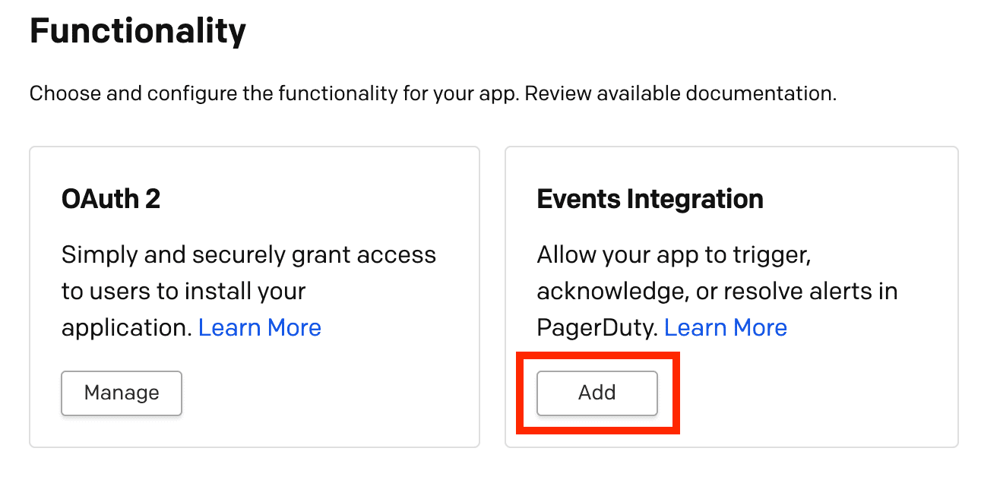
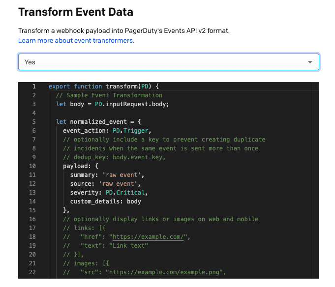
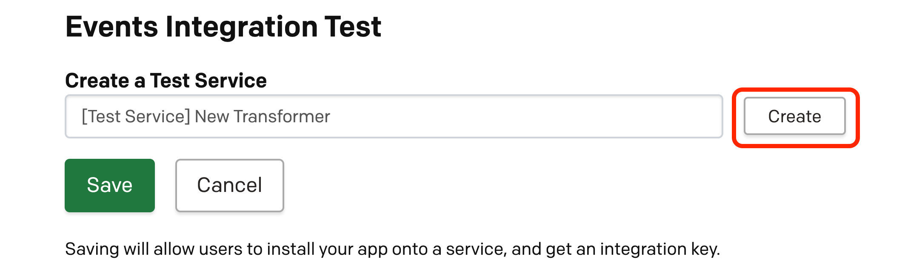
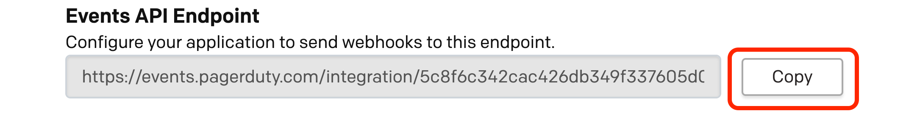
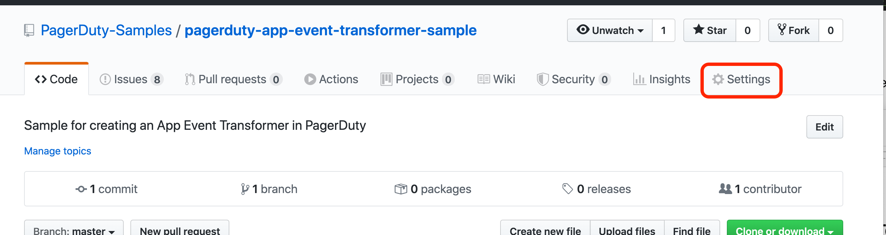
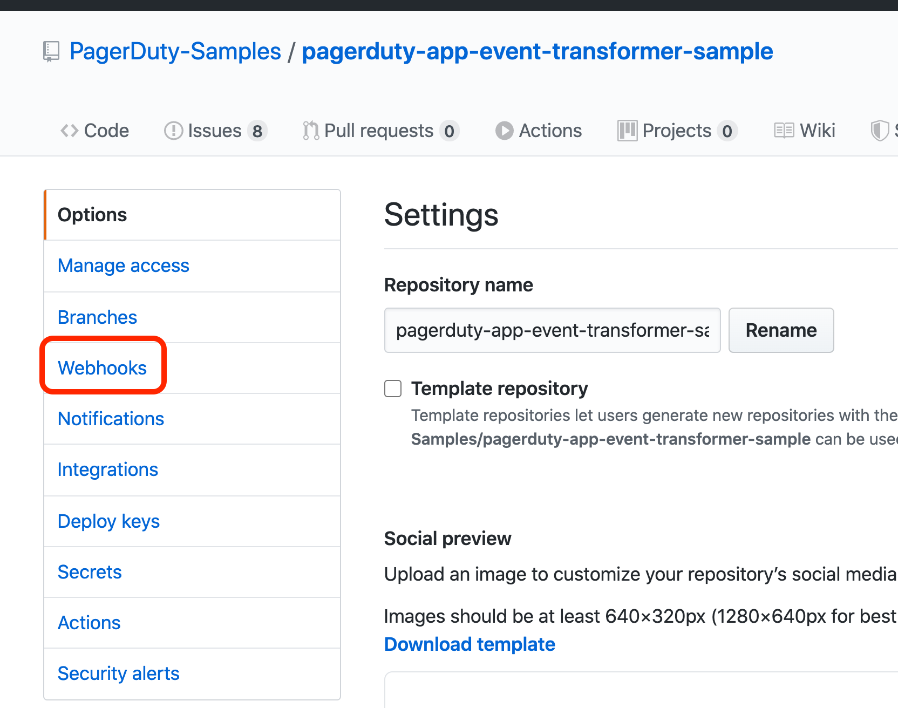
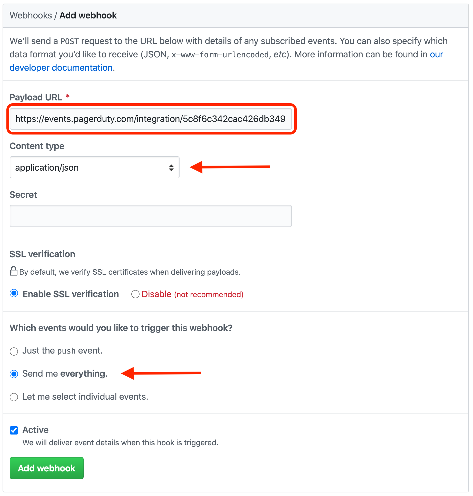
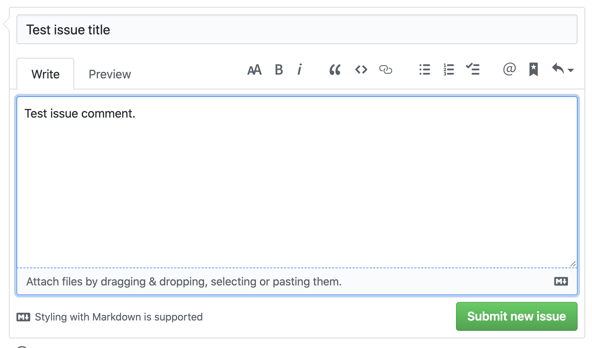
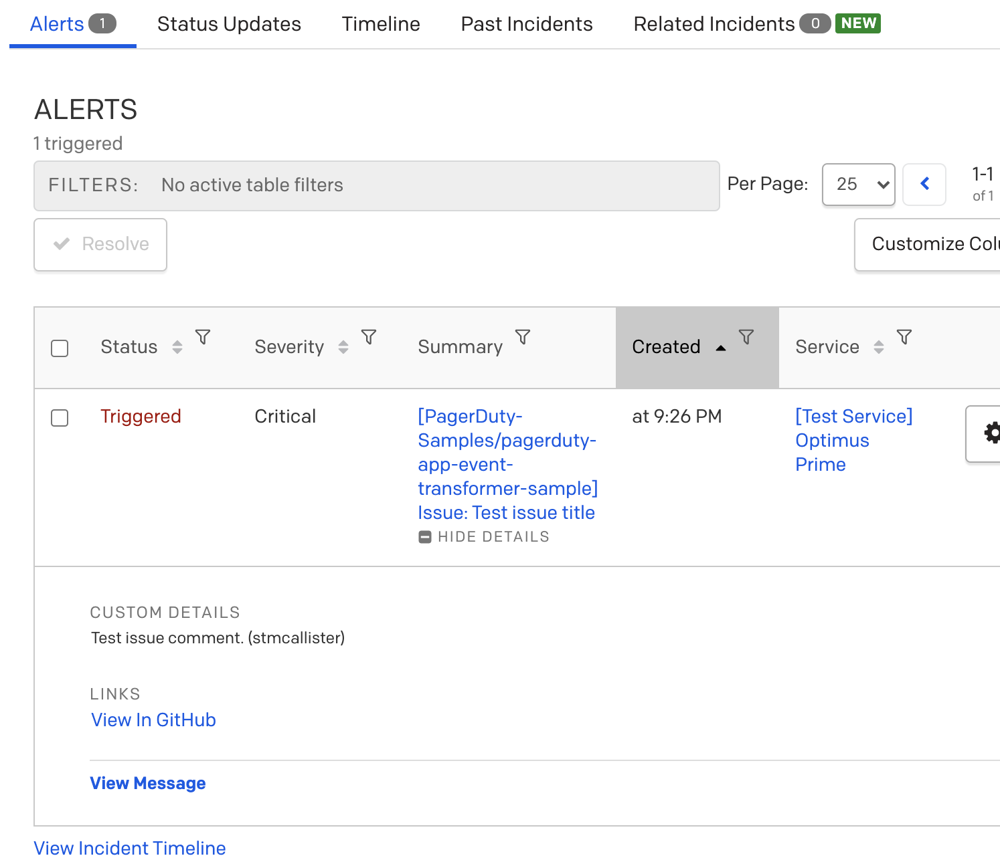

# PagerDuty App Event Transformer Sample
This project is a sample for creating an [App Event Transformer](https://developer.pagerduty.com/docs/app-integration-development/app-event-transforms/) in PagerDuty.

An Event Transformer is JavaScript code (ES6) used to convert a payload sent to PagerDuty into the [Common Event Format](https://developer.pagerduty.com/docs/events-api-v2/overview/#pagerduty-common-event-format-pd-cef) which is accepted by the [Events API v2](https://developer.pagerduty.com/docs/events-api-v2/trigger-events/). Event transformers are hosted and executed in PagerDuty.

An App Event Transformer is an Event Transformer that can be published and deployed as an Events Integration. To learn more about all the features available in an App Event Transformer, take a look at [Writing App Event Transformers](https://developer.pagerduty.com/docs/app-integration-development/app-event-transforms/). 

In this sample we're going to create an Event Transformer that triggers a PagerDuty Incident when an Issue is opened on a GitHub project using [GitHub webhooks](https://developer.github.com/webhooks/). 

# Setting Up In PagerDuty
To create an App Event Transformer go to the Developer Mode of your PagerDuty account.



In Developer Mode, [create an app](https://developer.pagerduty.com/docs/app-integration-development/register-an-app/).

In the Functionality section, select to **Add** and Events Integration.



The Event Integration page will have an option to Transform Event Data. Select "Yes". When you do so, a [Monaco](https://github.com/microsoft/monaco-editor) code editor will appear preloaded with a simple JavaScript function for transforming an object. 



We'll get to adding our own code in due time, but for now we need to progress down the page. We'll head passed the Debug Mode and Simple Install Flow sections and look at the Events Integration Test section. 

In the Events Integration Test section we're given the option to Create a Test Service. Since your Event Transformer will not be connected to any one Service until it's in production we need to create a Test Service to receive and manage events while building the transformer.  



Once the Test Service is created head back up to the Debug Mode section. Here we're asked if we want runtime errors in our Transformer to be sent as incidents in our test service we just created. This is highly recommended to help you better debug your Transformer as you're building it.

Debug mode will catch runtime errors, and syntax errors will be caught by Events Integration page. If you click the Save button any syntax errors will be announced at the top of the page, along with the line number of the problem.

At this point, let's go ahead and hit the Save button at the bottom of the page. This will save our configuration and kick us back us out to the Configure App page. Before heading over to GitHub we need to grab one thing from the Events Integration, and that's the Events API Endpoint.

The Events API Endpoint is a unique endpoint for accessing the Event Transformer. To retrieve it head back into the Events Integration section and scroll down to the Events Integration Test section.



Copy that value and head over to your GitHub project.

# Setting Up In GitHub
In order for your project to send out webhooks, go to the Settings tab on the far right.



In the Settings tab select Webhooks from the side menu.



When you select Add Webhook on that page you'll be sown the following form. 



**Payload URL:** paste the value copied from the Events API Endpoint here

**Content type:** set this to `application/json`

**Which events would you like to trigger this webhook?**
For now, select "Send me everything". You can refine this later, if you'd like.

Keep all other default values and select Add Webhook. Check out the reference for GitHub's [Issues](https://developer.github.com/webhooks/event-payloads/#issues) event payload to get an idea of how GitHub's webhooks are structured.

# Event Transformer Code
Now, the fun part! Let's edit the transformer code. For your Transformer to process GitHub webhooks copy the cody in [transformer.js](transformer.js) and hit the Save button on that page. This creates (or updates) an AWS Lambda that may need a minute to spin up. So, please give your Transformer a few minutes before firing test webhooks at it. 

## Explanation of Transformer Code
The `transform` function receives a `PD` utility object that helps you process and transform the incoming webhook into a PagerDuty Event. Check out [The PD Object](https://developer.pagerduty.com/docs/app-integration-development/app-event-transforms/#the-pd-object) for a full reference on the object. 

In our case the webhook from GitHub is represented in `PD.inputRequest`. We begin by capturing the `body` and `headers` of the webhook like so:

```javascript
// capture incoming webhook body
let body = PD.inputRequest.body;
// capture incoming webhook headers
const headers = PD.inputRequest.headers;
```

Using `headers` we then capture the GitHub Event Type.

```javascript
// capture the GitHub event type
for (var i = 0; i < headers.length; i++) {
    if('X-GitHub-Event' in headers[i]) {
        githubEventType = headers[i]['X-GitHub-Event'];
    }
}
```

After checking to make sure the captured GitHub Event Type is `issues` we then check the `action` to see if it's either `opened` or `reopened`. If it is, we create an `incidentSummary` using the name of the repository and the title of the issue.

```javascript
incidentSummary = `[${body.repository.full_name}] Issue:  ${body.issue.title}`;
```
Next, we grab the `html_url` of the issue to include the link in the event we create.

```javascript
let normalized_event = {
    event_action: PD.Trigger,
    dedup_key: dedupKey,
    payload: {
        summary: incidentSummary,
        source: 'GitHub',
        severity: PD.Critical,
        custom_details: `${body.issue.body} (${body.issue.user.login})`
    },

    links: [{
        "href": githubLinkURL,
        "text": "View In GitHub"
    }],
}
```
The `normalized_event` is the object that will create our event in PagerDuty. For a full reference on all the possible fields for the event object see the [Parameters](https://developer.pagerduty.com/docs/events-api-v2/trigger-events/#parameters) of the [Send a v2 Event](https://developer.pagerduty.com/docs/events-api-v2/trigger-events/) document.

With this code in place, scroll to the bottom of the page and click the Save button. Remember, it may take a couple minutes for your Transformer to update the changes. Please wait a bit before testing. 

Now, it's time to try it out! 

In your GitHub project you may have an issue that looks like this:



Which will create a PagerDuty incident that looks like this:



Hopefully you found this sample for creating an App Event Transformer helpful. Please [create an Issue](https://github.com/PagerDuty-Samples/pagerduty-app-event-transformer-sample/issues/new/choose) on this project if you have any questions or issues about this specific sample. 

To engage with our Developer Community, head over to the [Developer Forum](https://community.pagerduty.com/forum/c/dev) on the [PagerDuty Community](https://community.pagerduty.com/) site. It's a central gathering place for developers to share what they’re working on, post questions they have, or find information on developer tools that are available. Whether you’re working on a custom integration, extension, or an internal tool built specifically for your own team, the [Developer Forum](https://community.pagerduty.com/forum/c/dev) is a great place to share your project or things you learned. 
